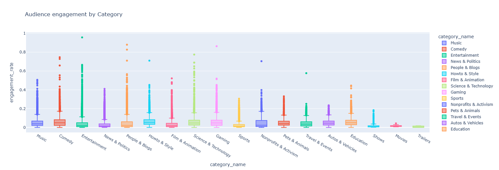
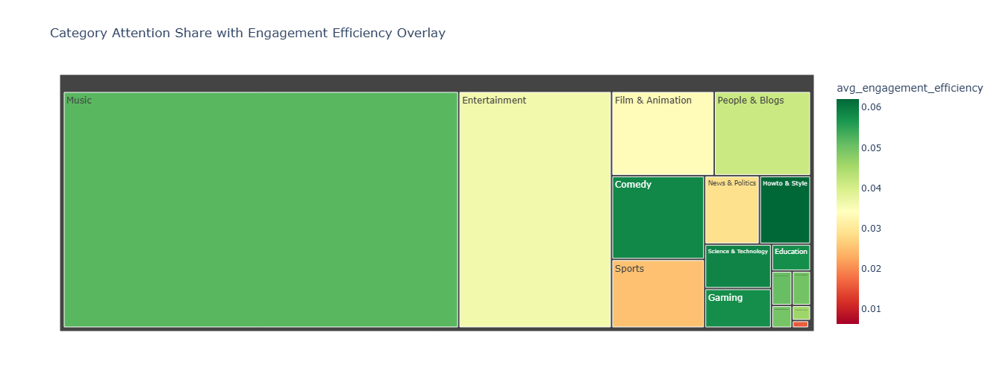

# Youtube Data Analysis

## Overview :

This project analyzes YouTube trending video data to uncover insights about views, likes, comments, and content categories. The goal is to understand what makes videos trend and identify patterns across different regions.

## Objectives :

- Perform data cleaning and preprocessing
- Analyze trends in views, likes, and comments
- Identify top-performing categories
- Visualize insights using graphs and charts

## Project Structure :

```
Youtube_Data_Analysis/
│
├── notebooks/
│   └── youtube_data_analysis.ipynb
│
├── outputs/
│   ├── audience_engagement_by_category.png
│   ├── category_attention_share.png
│   └── engagement_bubble_map.png
│
├── README.md
└── requirements.txt
```


## Dataset :
The dataset is not included in this repository due to its large size.

**Download Dataset:** https://drive.google.com/drive/folders/1OV597CngPKDa-HQPc8JRSHCnnT1ttmAk?usp=sharing


## Sample Outputs :

### Audience Engagement by Category:



This visualization shows how different YouTube categories perform in terms of audience engagement.

---

### Category Attention Share with Engagement Efficiency:



This chart highlights how attention is distributed across categories along with engagement efficiency.

---

### Engagement Bubble Map (Views vs Engagement Rate):


This bubble chart represents the relationship between video views and engagement rate across categories.


